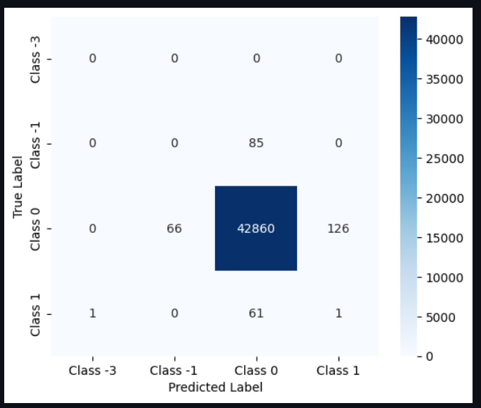
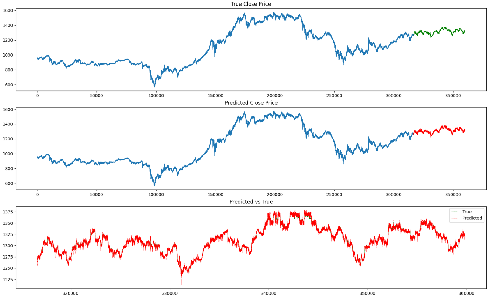

# VN30F1M Prediction

## Overview
This project focuses on building Random Forest model for predicting Close Price of VN30F1M. I explored different approaches and compare performance metrics to determine the best model for the task.

## Features
- **Data Preprocessing**: Create Labels, InterQuarter Range, Moving Average.
- **Model Training**: Training Random Forest Model in both classification and regression approaches.
- **Evaluation Metrics**: Analyzing model performance.
- **Visualization**: Graphs and images for results interpretation.

## Installation
To run this project, install the required dependencies using:
```bash
pip install -r requirements.txt
## Experiments

